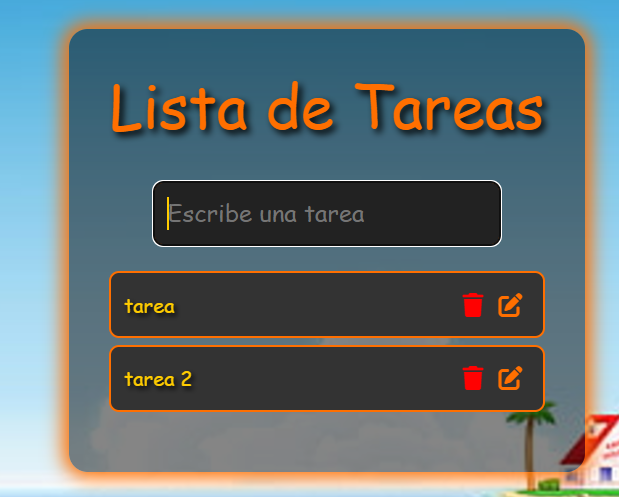
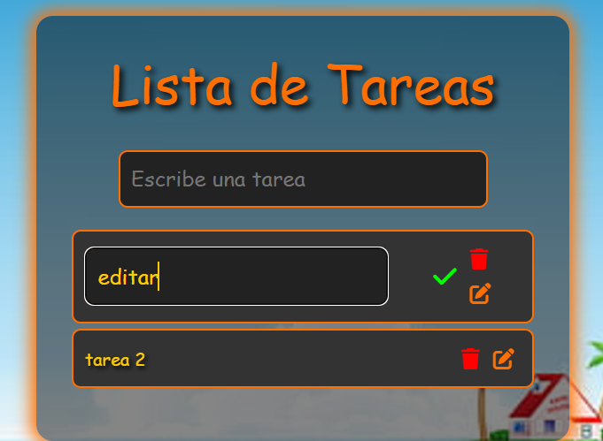

# To-Do List - Versión Dragon Ball

Una lista de tareas interactiva inspirada en el universo de **Dragon Ball**, con un diseño basado en la icónica "Kame House". Este proyecto permite gestionar tareas (añadir, editar, eliminar) y las guarda utilizando la API de 4Geeks Academy.

## Capturas de Pantalla

### Pantalla Inicial

### Añadir Tareas

### Editar Tareas

## Funcionalidades

- **Añadir tareas**: Escribe una nueva tarea y guárdala.
- **Editar tareas**: Modifica cualquier tarea existente.
- **Eliminar tareas**: Borra tareas de la lista.
- **Conexión a API**: Las tareas se almacenan y gestionan a través de una API externa de 4Geeks Academy.
- **Estilo único**: Inspirado en Dragon Ball, con colores vibrantes y un fondo temático.

## Tecnologías Utilizadas

- **React**: Para gestionar la interfaz y el estado de la aplicación.
- **CSS**: Para estilizar la aplicación con detalles de Dragon Ball.
- **API de 4Geeks Academy**: Para almacenar y recuperar las tareas.

## Autor

**Aaron Cuadrado Toral**  
Desarrollador Full Stack apasionado por la creación de aplicaciones funcionales y visualmente atractivas.

- **GitHub**: [AaronCuadrado](https://github.com/AaronCuadrado)  
- **LinkedIn**: [Aaron Cuadrado Toral](https://www.linkedin.com/in/aaroncuadrado/)  

